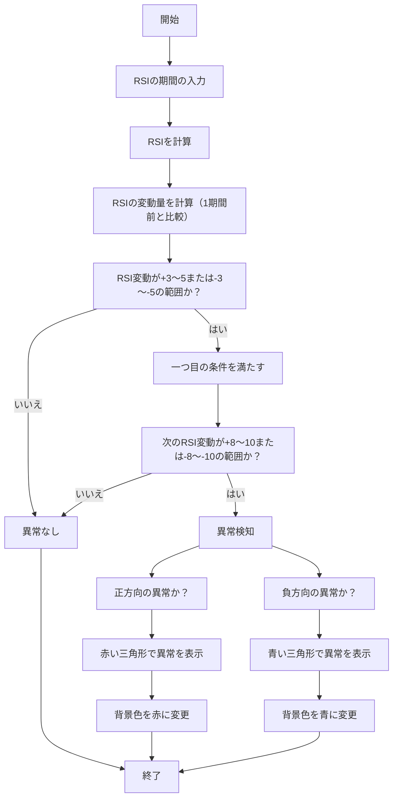

# RSI_Anomaly_Detection_with_Two-Step_Movement_Visualization

```mermaid
flowchart TD
    A[開始] --> B[RSIの期間の入力]
    B --> C[RSIを計算]
    C --> D[RSIの変動量を計算（1期間前と比較）]

    D --> E[RSI変動が+3～5または-3～-5の範囲か？]
    E --> |はい| F[一つ目の条件を満たす]
    E --> |いいえ| I[異常なし]
    
    F --> G[次のRSI変動が+8～10または-8～-10の範囲か？]
    G --> |はい| H[異常検知]
    G --> |いいえ| I[異常なし]
    
    H --> J[正方向の異常か？]
    H --> K[負方向の異常か？]
    
    J --> L[赤い三角形で異常を表示]
    L --> M[背景色を赤に変更]
    K --> N[青い三角形で異常を表示]
    N --> O[背景色を青に変更]
    
    I --> P[終了]
    M --> P[終了]
    O --> P[終了]
```
